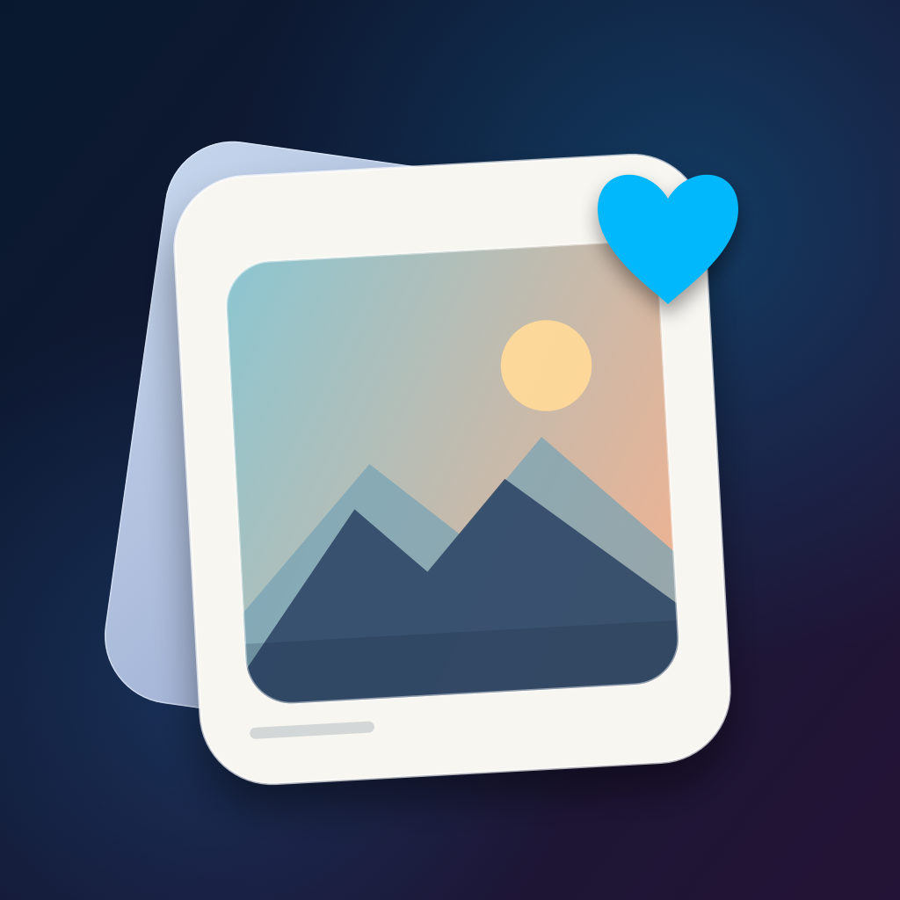
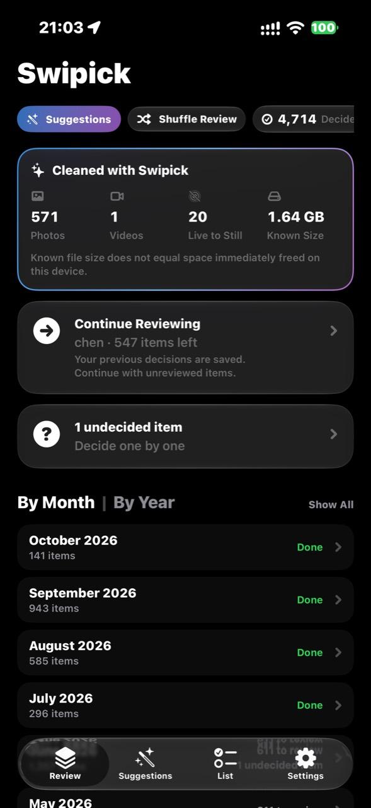
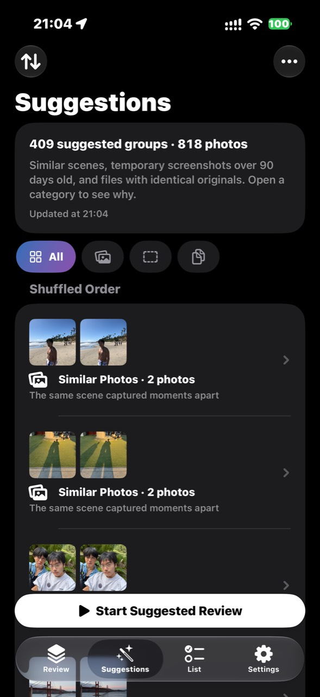

<p align="center">
  
</p>

# Swipick · 择影

**一次一张，让整理照片成为简单的选择。**

Swipick 是一个个人 iOS App 项目：用左右滑动整理照片与视频，把保留、待删和待决定分开，最后集中确认对系统图库的修改。项目使用 SwiftUI 构建原生界面，结合 Liquid Glass、叠放卡片和触觉反馈，探索照片整理中的效率与操作可控性。

**Swift · SwiftUI · PhotoKit · SwiftData · Vision · CryptoKit · Swift Testing · iOS 26+**

[English overview](#english-overview) · [完整使用指南](docs/USER_GUIDE.zh-CN.md)

## 界面预览 · UI Preview

<table>
  <tr>
    <th>审核首页 · Review Home</th>
    <th>清理建议 · Cleanup Suggestions</th>
  </tr>
  <tr>
    <td></td>
    <td></td>
  </tr>
</table>

首页将清理进度、继续审核和时间分类集中展示；建议页将相似照片、重复副本和旧临时截图分组，并解释推荐原因。截图来自实际使用，图中的数量仅代表拍摄时的个人图库状态。

## 项目亮点 · Engineering Highlights

- **从产品流程到原生实现**：围绕“筛选 → 判断 → 确认”组织界面，支持手势审核、可撤销决定和跨次继续。
- **本机图像分析**：结合 Vision 图像特征、文字识别和 CryptoKit 资源哈希生成清理建议，由用户决定最终操作。
- **图库操作可靠性**：将本地审核记录与 PhotoKit 写入分离，为 Live Photo 转换保存恢复记录，并在删除原件前核对副本。
- **资源与体验权衡**：按需预览、缓存与限量后台检查，避免建议扫描主动下载 iCloud 原片；提供中英文资源与行为测试。

## 从选择到确认

1. **选择范围**：按月份、媒体类型或个人相簿开始，也可以随机审核未处理项目。
2. **逐张决定**：左划待删、右划保留；点按左右区域同样有效。暂时拿不定主意时放入“待决定”，误操作可以撤销。
3. **集中确认**：在清单中分别确认删除、收藏和相簿整理，再通过系统权限与确认流程写入照片图库。

清理进度保存在本机，下次打开可以从上次的分类继续。

## 功能与交互

| 场景 | 实现 |
| --- | --- |
| 快速审核 | 叠放卡片、手势反馈、点按操作、撤销、待决定和随机排序 |
| 查看媒体 | 照片缩放、视频播放与静音、长按播放 Live Photo、系统分享 |
| 辅助判断 | 拍摄日期、照片信息、文件大小与已有收藏状态 |
| 清理建议 | 本机分析重复副本、相似照片与旧临时截图；连续组内比较、截图分类逐张审核、撤销与继续 |
| 整理图库 | 暂存收藏与目标相簿，清单确认后提交；支持新建相簿 |
| Live Photo 转静态 | 创建并核对静态副本，保留拍摄时间与可写个人相簿，再确认删除原件 |
| 持续清理 | 本地进度、继续审核入口、照片和视频删除统计、转换统计 |
| 首次使用 | 照片权限入口、可跳过的使用指南、中英文资源与触觉设置 |

## 技术实现

- **界面与媒体服务分层**：`UI` 负责展示与交互，`Library` 封装 PhotoKit 和媒体操作，`Core` 管理审核记录与本地状态。
- **决定与图库写入分离**：SwiftData 保存审核决定和待办，用户确认后才提交对应的系统操作。
- **预览按需加载**：提前准备下一张本地预览；Live Photo 动态内容在长按时加载，视频预览与文件大小获取独立处理。
- **转换与中断恢复**：Live Photo 转换记录持久化，核对副本后才进入原件删除流程；转换中断后尝试恢复。
- **文件大小缓存**：按照片修改时间缓存已读取的大小，自动读取本地资源时不主动下载 iCloud 原片。
- **本机推荐分析**：Vision 图像特征与截图文字识别筛选照片组，完整资源哈希确认重复。资源不同的相近版本支持同时保留；扫描缓存、跳过记录与继续审核进度保存在本机。
- **临时截图与低耗检查**：截图需要同时有超过 90 天的拍摄时间和临时内容证据，按订单结果、取件码、验证码、已送达物流、过期活动与优惠券分类，沿用逐张审核。系统自行安排后台检查；低电量或明显发热时暂停，每轮限量、缓存续接，不下载云端原片。
- **行为测试**：使用 Swift Testing 覆盖审核持久化、撤销、收藏与删除互斥、相簿待办、继续审核状态、设置和滑动判定等逻辑。

## 本地运行

需要支持 iOS 26 SDK 的 Xcode；工程最低部署版本为 **iOS 26.0**。源码中的工程、scheme 和 App target 仍名为 `Zeying`。

```sh
git clone https://github.com/Mars-Kinga/swipick.git
cd swipick
open Zeying.xcodeproj
```

选择 `Zeying` scheme 和 iPhone 模拟器或设备运行。安装到自己的 iPhone 时，在 **Signing & Capabilities** 中选择开发团队，并按需修改 Bundle Identifier。启动后授予照片访问权限；限定访问下只展示获准访问的资源。

命令行构建：

```sh
DEVELOPER_DIR=/Applications/Xcode.app/Contents/Developer \
  xcodebuild -project Zeying.xcodeproj -scheme Zeying \
  -destination 'generic/platform=iOS Simulator' \
  -derivedDataPath /tmp/ZeyingDerived CODE_SIGNING_ALLOWED=NO build
```

在 Xcode 中使用 **Product → Test** 运行测试。照片授权、iCloud 下载、图库写入和系统确认仍需在设备或适用的模拟器环境手动验收。

## 项目结构

```text
Zeying/
├── Core/          审核记录、待办、设置与继续审核状态
├── Library/       图库访问、相簿、文件大小与 Live Photo 转换
├── UI/            首页、审核卡片、清单、设置与媒体预览
├── Assets.xcassets/
├── en.lproj/
└── zh-Hans.lproj/
ZeyingTests/        Swift Testing 行为测试
Tools/             图标生成工具
```

## 数据与当前边界

审核进度保存在设备本机；卸载 App 会移除这些进度。iCloud 原片由系统照片服务提供，主动获取原片、分享或转换可能触发下载。

删除会作用于系统图库，并可能通过 iCloud 同步到其他设备。统计中的已知资源大小不代表立即释放的设备空间，仍受“最近删除”和同步状态影响。Live Photo 转静态需要完整照片权限，副本不保留动态片段或编辑历史。目前不提供系统“人物与宠物”分组入口。

本仓库展示项目源码，运行与安装方式见上文；详细操作行为见[使用指南](docs/USER_GUIDE.zh-CN.md)。

## English overview

**Swipick** is a personal native iOS project for reviewing photos and videos one at a time. Swipe left to queue deletion, swipe right to keep, or defer a decision for later. Review choices stay on the device; queued deletions, favorites and album assignments are confirmed before being written to the system photo library.

Built with **SwiftUI, PhotoKit, SwiftData, Vision and CryptoKit**, the app includes month and album filters, undo, resumable review sessions, video and Live Photo previews, file-size caching, and Live Photo-to-still conversion with persisted recovery state. On-device suggestions combine image features, screenshot text recognition and resource hashes to identify review candidates, while the user retains the final decision. Its interface combines Liquid Glass with stacked review cards and haptic feedback. Chinese and English localization resources are included.

To run it, open `Zeying.xcodeproj` in an Xcode version supporting the iOS 26 SDK, select the `Zeying` scheme, and choose a simulator or your iPhone. Device installation requires configuring your development team and bundle identifier. The minimum deployment target is **iOS 26.0**. Run the included Swift Testing tests through **Product → Test** in Xcode.
